# Sysmon
Sysmon - это инструмент, который позволяет дополнить и расширить стандартную систему мониторинга событий в Windows.  
Утилиту можно установить с оффицального сайта Microsoft вот [тут](https://download.sysinternals.com/files/Sysmon.zip)  
Для установки Sysmon также нужен конфигурационный файл с правами. Вот несколько примеров: [с привязкой к Mitre Att&ck](https://github.com/olafhartong/sysmon-modular/blob/master/sysmonconfig.xml) и [от ion-storm](https://raw.githubusercontent.com/ion-storm/sysmon-config/develop/sysmonconfig-export.xml)

Открываем cmd с правами администратора:
```
Sysmon64.exe -accepteula -i sysmonconfig.xml
```
где sysmonconfig.xml - конфигурационный файл с правилами.  

Для просмотра событий в "Event Viewer" нужно перейти в Applications and Services Logs -> Microsoft -> Sysmon -> Operational

## Event ID 1 - Process Create / Создание процесса
В событии содержится подробная информация о новом созданном процессе:
- PID;
- Образ процесса - его фактическое месторасположение;
- Описание;
- Название;
- Командная линия, при помощи которой был запущен процесс;
- Пользователь, от имени которого был создан процесс;
- Logon ID - уникальный id сессии, который совпадает с id от Event 4624;
- Хеш-суммы в SHA1, MD5, SHA256;
- PID родительского процесса;
- Командная линия родительского процесса, при помощи которой был запущен процесс;
- Пользователь родитель, от имени которого был создан родительский процесс.

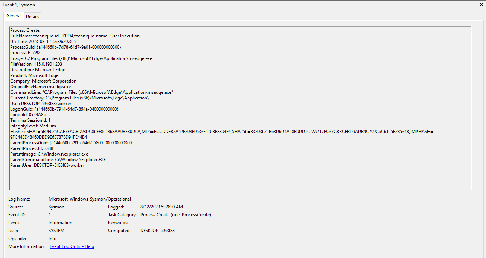  


## Event ID 2 - File creation time changed / Изменение времени создания файла
В событии содержится информация о измненении времени создания файла в UTC:
- PID, изменивший время файла;
- Образ процесса, изменивший время файла;
- Файл, у которого изменили время;
- Новое время файла в UTC;
- Оригинальное время файла в UTC;
- Пользователь, который изменил время файла

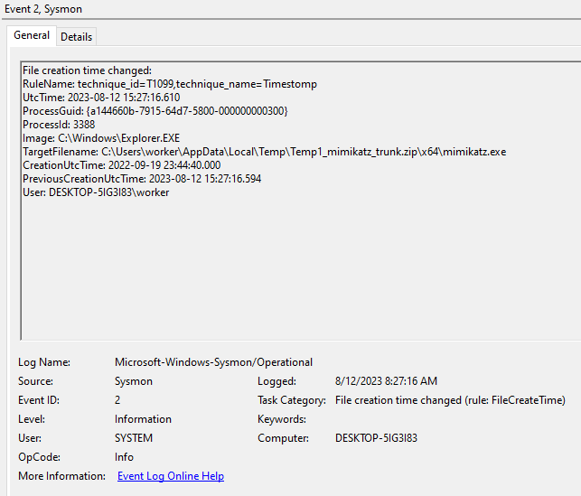

## Event ID 3 - Network connection detected / Новое сетевое подключение
В событии содержится информация о новом сетевом подключении:
- PID;
- Образ процесса, который выполнил подключение;
- Пользователь;
- Протокол;
- Инициатор (true/false);
- IP источника;
- Hostname источника;
- Порт источника;
- IP удаленного хоста;
- Hostname удаленного хоста;
- Порт удаленного хоста.

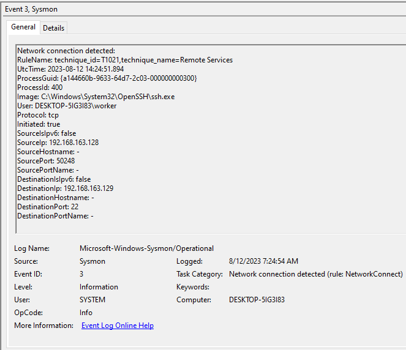

## Event ID 4 - Sysmon service state changed / Изменение состояния Sysmon
В событии содержится информация об изменении состояния Sysmon:
- Статус (Started/Stopped)
- Версия Sysmon;
- Schema Version.

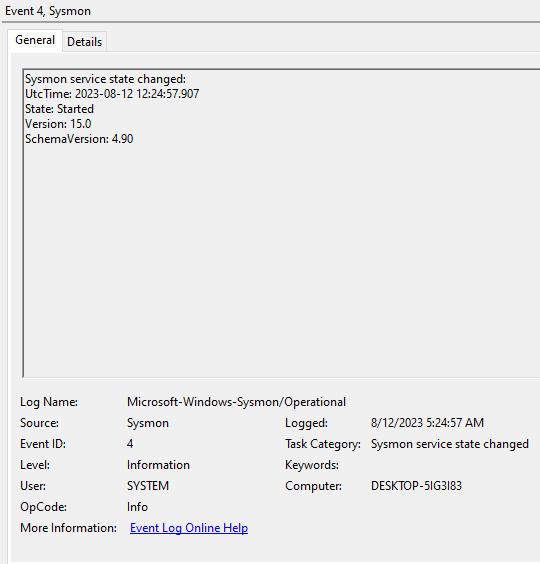

## Event ID 5 - Process terminated / Процесс завершен
В событии содержится информация о завершенном процессе:
- PID;
- Образ процесса;
- Пользователь.

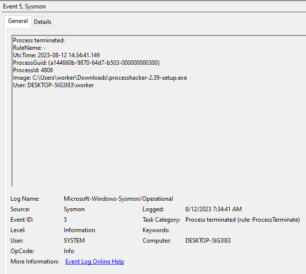

## Event ID 6 - Driver loaded / Загружен драйвер
В событии содержится информация о загрузки процессом драйвера (или dll):
- Образ драйвера;
- Хеш-суммы образа в SHA1, MD5, SHA256;
- Подпись (True/False);
- Сигнатура подписи;
- Статус подписи.

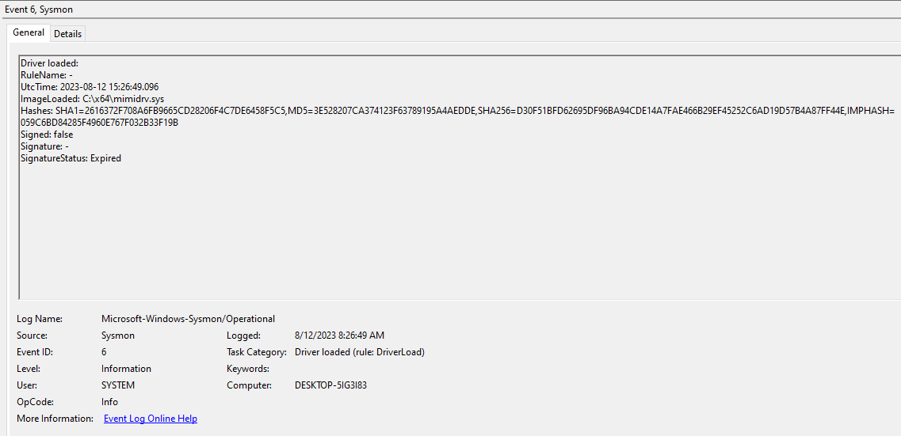

## Event ID 7 - Image Loaded / Загружен образ
В событии содержится информация о загруженном образе файла, то есть когда процесс вызывает какой-либо другой файл:
- PID;
- Образ процесса, который загрузил другой образ;
- Загружаемый образ;
- Версия образа;
- Информация об образе;
- Продукт;
- Оригинальное имя образа;
- Хеш-суммы образа в SHA1, MD5, SHA256ж
- Подпись (True/False);
- Сигнатура подписи;
- Статус подписи;
- Пользователь.

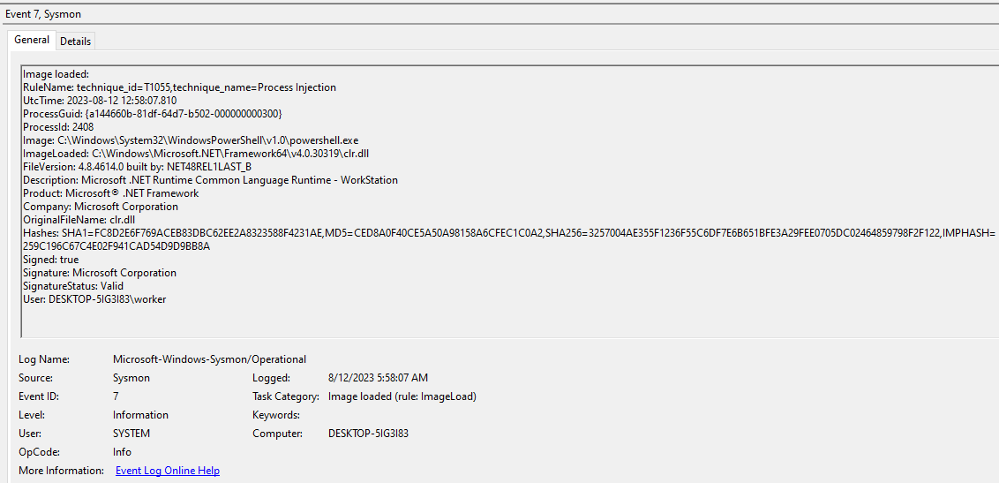

## Event ID 8 - CreateRemoteThread / Создание потока в другом процессе
В событии содержится информация о создании процессом потока в другом процессе:
- PID процессов;
- Образы процессов;
- ID потока;
- Адрес потока в памяти;
- Пользователи процессов.

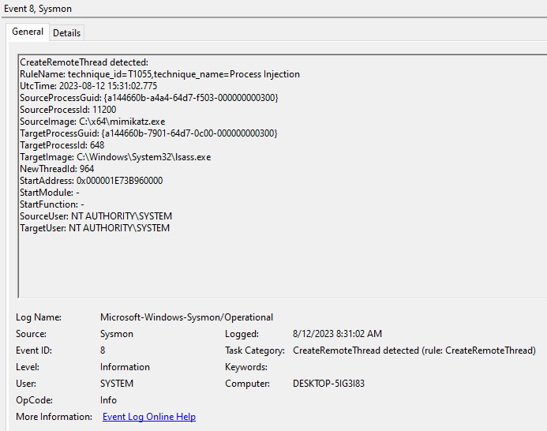

## Event ID 9 - RawAccessRead / Операция "прямого" чтения
В событии содержится информация о чтении данных, которые были выполнены при помощи \\\\.\\, что позволяет читать данные "напрямую", обходя ограничения на чтение:
- PID;
- Образ;
- Устройство, с которого читали данные.


## Event ID 10 - ProcessAccess / Операция обращения процесса к другому процессу
В событии содержится информация об обращении процесса к другому процессу, например, чтение памяти процесса:
- PID процессов;
- Образы процессов;
- Права доступа;
- Строка вызова;
- Пользователи процессов.

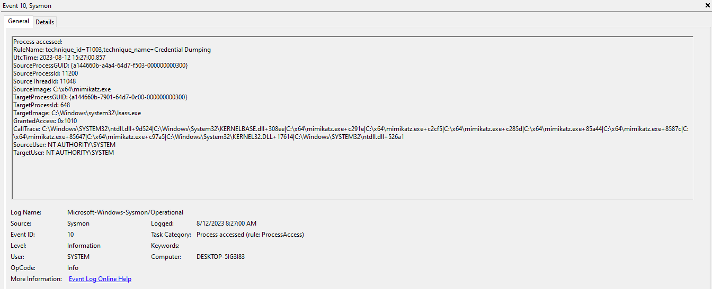

## Event ID 11 - FileCreate / Создание файла
В событии содержится информация о создании файла другим процессом:
- PID;
- Образ процесса;
- Имя созданного файла;
- Время создания файла;
- Пользователь.

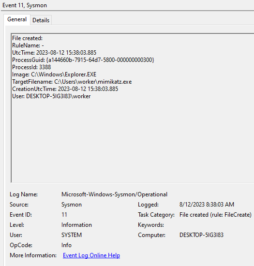

## Event ID 12 - RegistryEvent / Операции создания или удаления объектов в регистре
В событии содержится информация о создании или удалении объектов в разделах регистра:
- Тип события (DeleteKey/DeleteValue)
- PID;
- Образ;
- Объект в реестре;
- Пользователь.

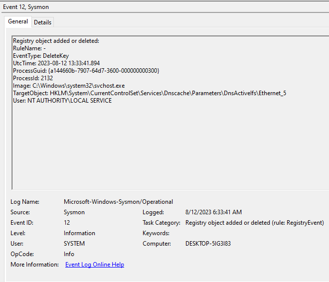

## Event ID 13 - RegistryEvent / Операции изменения объектов в регистре
В событии содержится информация об изменении объектов в разделах регистра:
- Тип события (SetValue)
- PID;
- Образ;
- Объект в реестре;
- Детали;
- Пользователь.

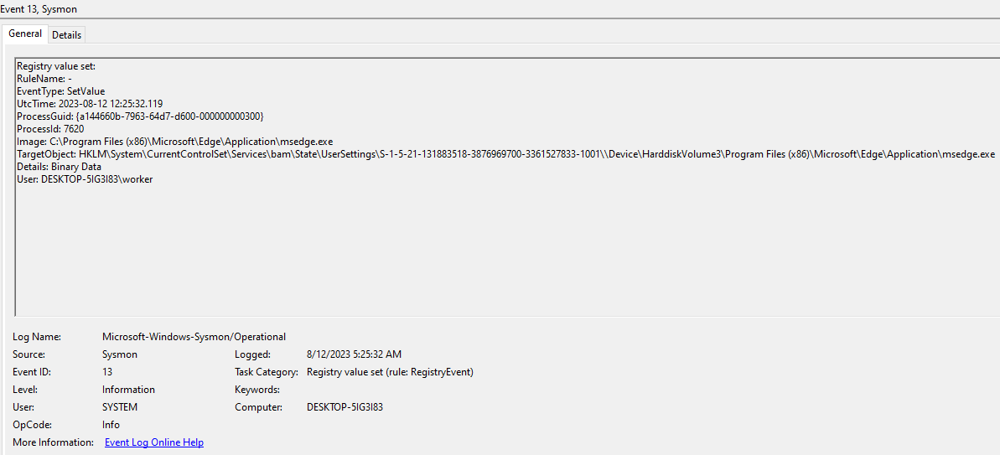

## Event ID 14 - RegistryEvent / Операции изменения имен объектов в регистре
В событии содержится информация об изменении имен объектов в разделах регистра:
- Тип события (RenameKey)
- PID;
- Образ;
- Объект в реестре;
- Детали;
- Новое имя;
- Пользователь.


## Event ID 15 - FileCreateStreamHash / Создание файлового потока процесса
В событии содержится информация о создании файлового потока процесса:
- PID;
- Образ;
- Имя созданного потока;
- Время создание потока;
- Хеш-суммы в SHA1, MD5, SHA256;
- Контент файлового потока;
- Пользователь.

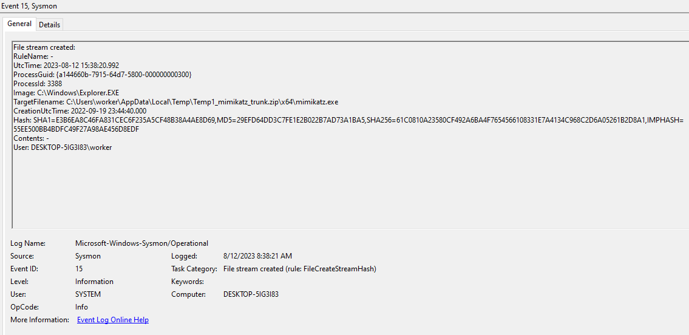

## Event ID 16 - ServiceConfigurationChange / Изменение конфигурации Sysmon
В событии содержится информация об изменении конфигурации Sysmon:
- Конфигурационный файл;
- Хеш-сумма файла в SHA256.

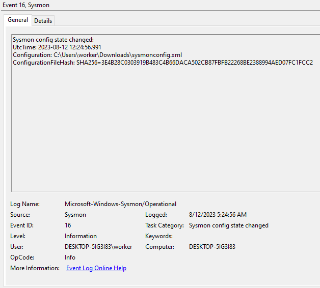

## Event ID 17 - PipeEvent / Создание pipe
В событии содержится информация о создании pipe-канала процесса:
- Тип события (CreatePipe);
- PID;
- Имя канала;
- Образ;
- Пользователь.

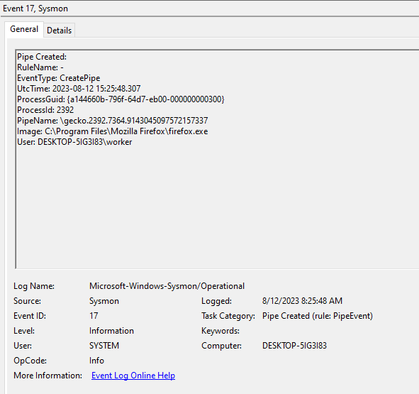

## Event ID 18 - PipeEvent / Подключение по pipe
В событии содержится информация о подключение по pipe-каналу процесса:
- Тип события (ConnectPipe);
- PID;
- Имя pipe;
- Образ.


## Event ID 19 - WmiEventFilter / Взаимодействие с WMI Filter
- Тип события (WmiFilterEvent);
- Операция (Create/Modified/Deleted);
- Пользователь;
- Пространство создания WMI;
- Имя фильтра;
- Запрос.


## Event ID 20 - WmiEventConsumer / Взаимодействие с WMI Consumer
- Тип события (WmiConsumerEvent);
- Операция (Create/Modified/Deleted);
- Пользователь;
- Пространство создания WMI;
- Имя "потребителя";
- Расположение.


## Event ID 21 - WmiEventConsumerToFilter / Взаимодействие с WMI Filter to Consumer
- Тип события (WmiConsumerEvent);
- Операция (Create/Modified/Deleted);
- Пользователь;
- Пространство создания WMI;
- Имя фильтра;
- Фильтер;
- Расположение.


## Event ID 22 - DNSEvent / Запрос DNS
В событии содержится информация о DNS запросе:
- PID;
- DNS имя;
- Статус запроса;
- Результат запроса;
- Образ;
- Пользователь.

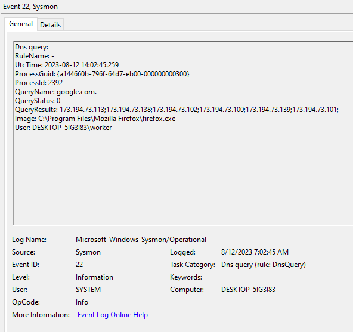

## Event ID 23 - FileDelete / Удален файл с архивацией
- PID;
- Образ процесса, удаливший файл;
- Имя удаленного файла;
- Хеш-суммы файла;
- Статус архивации.


## Event ID 24 - ClipboardChange / Изменение системного буфера обмена
- PID;
- Образ;
- Тип сессии (0 - системный, 2 - интерактивный и т.д.);
- Информация о пользователе: имя пользователя, hostname, ipж
- Хеш-суммы;
- Статус архивации.


## Event ID 25 - ProcessTampering / Изменение образа процесса
В событии содержится информация об изменении образа процесса, который уже запущен:
- PID;
- Образ;
- Тип.


## Event ID 26 - FileDeleteDetected / Файл был удален
- PID;
- Пользователь
- Имя файла;
- Хеш-суммы;
- Исполняемый файл (true/false).

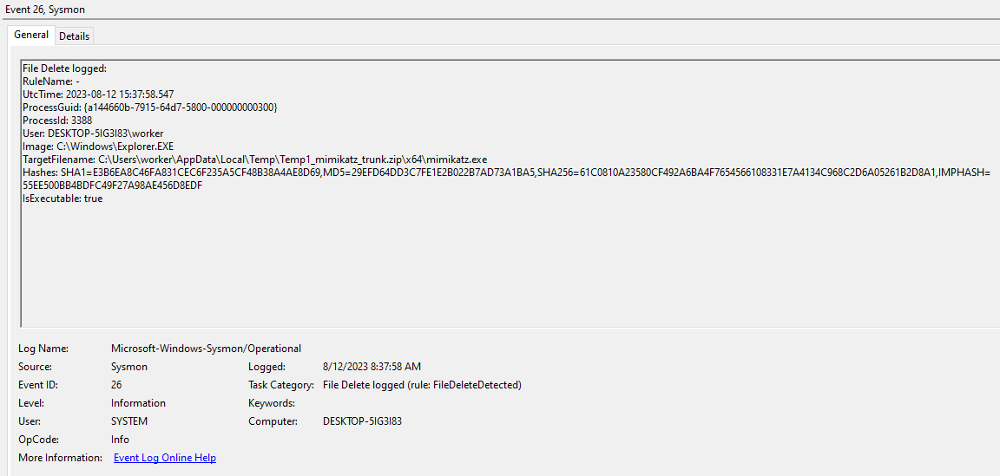

## Event ID 27 - FileBlockExecutable / Файл заблокирован
В событии содержится информация об блокировке Sysmon процесса:
- PID;
- Образ;
- Имя файла.


## Event ID 28 - FileBlockShredding / Файл "измельчитель" заблокирован
В событии содержится информация об блокировке Sysmon процесса, так как он удалил файл:
- PID;
- Образ;
- Имя файла;
- Хеш-суммы;
- Исполняемый файл (true/false).


## Event ID 29 - FileExecutableDetected / Создание нового исполнямого файла
- PID;
- Пользователь;
- Образ;
- Имя файла;
- Хеш-суммы.

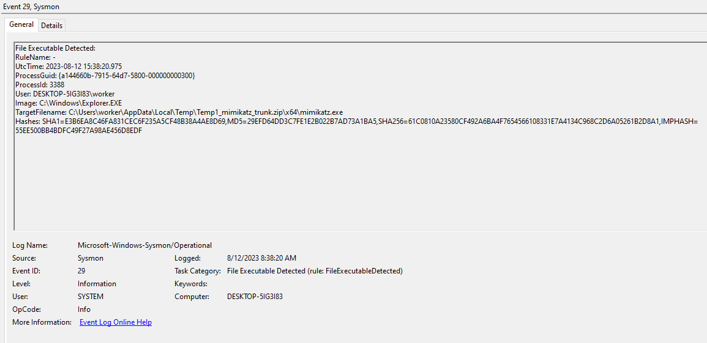

## Event ID 255 - Error / Ошибка
В событии содержится информация об ошибке в Sysmon:
- ID;
- Описание.

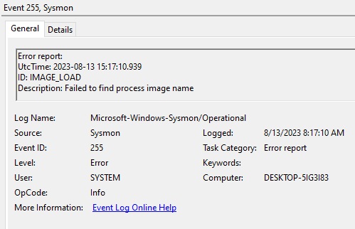
